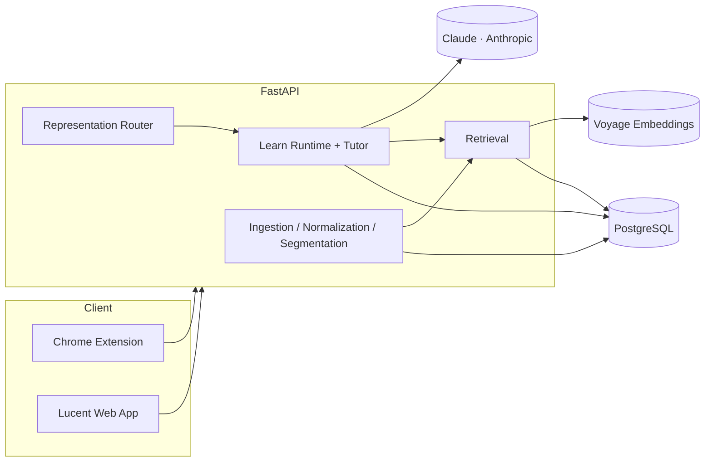

<div align="center">

# Lucent

**Read difficult material without leaving the page, then actually learn it.**

Lucent is a Chrome extension paired with a web app. The extension explains and simplifies text in context as you browse; the web app turns anything you save into a source-grounded, adaptively tutored Learn session.

<br />

<a href="https://chromewebstore.google.com/detail/lucent-reader/jlacohdmkdcjhechfkbhkpdiaggffnkn?authuser=0&hl=en">
  
</a>


<br /><br />


</div>

---

## What it is

Most "AI reading" tools do one of two things: rewrite the text, or generate a quiz over it. Neither is the same as actually understanding the material. Lucent tries to close that gap by keeping the tutoring behavior grounded in the source and honest about what it does and doesn't know yet.

It has two connected surfaces:

**The extension** sits in the side panel. Select a hard passage, and it explains it using the surrounding page as context rather than treating your selection as an isolated snippet — or simplifies it to a reading level and length you choose, without flattening it into a generic summary.

**The web app (Open Lucent)** is where saved material becomes a Learn session: source-grounded notes, adaptive questions, hints, step-through visuals, and progress that persists across sessions instead of resetting every time you come back.

---

## Retrieval, not just generation

Notes and quizzes are useful, but they're generated text — they can drift from the source. Lucent's Learn and Ask Lucent features are built on retrieval instead:

```
PDF / DOCX / PPTX
      │
      ▼
PyMuPDF + MarkItDown extraction
      │
      ▼
deterministic normalization (strip repeated page furniture, repair layout)
      │
      ▼
segmentation into LearningBlocks (page/section/block provenance kept)
      │
      ▼
Voyage embeddings, indexed asynchronously
      │
      ▼
retrieval at answer/question time
```

A document has a `source-index` readiness state, and generated notes are never used as retrieval evidence for themselves — only the original source blocks are. If an upload predates indexing, it's re-indexed from the persisted blocks rather than silently falling back to ungrounded generation.

---

## A tutor with a leash on it

The tutoring loop is deterministic by default: a small set of content policies (`CONCEPTUAL`, `PROCESS`, `QUANTITATIVE`, `MEMORIZATION`, `CS_SYSTEMS`) decide the initial teaching strategy, scaffold level, and when a concept is due for review, based on the objective itself — no model call required.

Where a model is actually useful — diagnosing *why* an answer was wrong — Lucent calls Claude to classify the response and pick a remediation strategy from a fixed, validated set. It cannot mutate session state, invent a new strategy, or write UI code; it returns a typed decision, the backend validates it, and deterministic code applies it. A malformed or over-length model response gets re-prompted against the exact limit it violated, and falls back to the deterministic policy rather than corrupting the session.

Same split governs how a passage becomes a visual: a deterministic router scores the text for process/quantitative/comparison/etc. signals and picks a structured representation (worked example, animated mechanism, comparison) — never an LLM freehand-generating frontend code.

---

## Architecture



The extension and web app authenticate differently on purpose: the web app uses an opaque, HttpOnly session cookie, while the extension uses a separate device-grant flow — a short-lived access token in `chrome.storage.session` and a rotating refresh token kept out of extension storage entirely, in background-origin IndexedDB.

---

## Technology

| | |
|---|---|
| **Extension** | Plasmo, Chrome Manifest V3, TypeScript |
| **Web app** | React, TypeScript, Vite, React Router, react-three-fiber (the landing page's spatial scroll scene), Framer Motion |
| **Backend** | Python, FastAPI, SQLAlchemy, Alembic |
| **Database** | PostgreSQL |
| **AI** | Claude (Anthropic) for generation, diagnosis, and remediation; Voyage embeddings for retrieval |
| **Auth** | Google OAuth, HttpOnly session cookie (web), device-grant tokens (extension) |
| **Deployment** | Docker Compose, GitHub Actions CI |

---

## Testing

CI runs the backend suite against a real Postgres service container, not a mock, on every PR and push to `main`.

```
Backend:  432 tests across 42 modules
Web:      18 test suites (vitest)
```

Coverage includes Learn-session persistence and resume, grading, hint budgets, the ingestion/normalization pipeline, retrieval indexing, auth flows for both the web session and the extension device grant, and migrations.

---

## Project structure

```
accessibility-reader/
├── background.ts, sidepanel.tsx, options.tsx   # extension entry points (Plasmo)
├── contents/                                    # content scripts
├── backend/
│   ├── app/
│   │   ├── routers/       # auth, documents, learn, notes, quizzes, ingestion, sources
│   │   ├── services/      # learn_runtime, learn_tutor, adaptive_policy, retrieval, anthropic_service
│   │   ├── ingestion/     # PDF / DOCX / PPTX extraction
│   │   ├── normalization/ # layout repair, dedupe
│   │   ├── segmentation/  # LearningBlock construction
│   │   ├── semantic/      # note/quiz planning and assembly
│   │   ├── routing/       # deterministic representation router
│   │   └── models/, schemas/
│   ├── migrations/
│   └── tests/
├── web/
│   └── src/
│       ├── pages/         # Library, Notes, QuizPage, SourceDetail, LandingPage, Auth
│       ├── learning/       # step-through mechanisms, structured visuals, schemas
│       ├── components/
│       └── api/
└── docs/
```

---

## Running locally

**Extension** (repo root)

```bash
pnpm install
pnpm dev
```

Load `build/chrome-mv3-dev` as an unpacked extension in Chrome.

**Backend**

```bash
cd backend
python -m venv venv && source venv/bin/activate
pip install -r requirements.txt
cp ../.env.production.example .env   # fill in ANTHROPIC_API_KEY, VOYAGE_API_KEY, Google OAuth, DATABASE_URL
alembic upgrade head
uvicorn app.main:app --reload
```

**Web app**

```bash
cd web
npm install
npm run dev
```

---

## Status

The extension is live on the Chrome Web Store. The backend — auth, ingestion, RAG indexing, Learn sessions, and the bounded tutor — is built and under test. Open Lucent, the hosted web app, is targeting **September 12** for its first public opening.

What's next: broadening the structured visual library beyond step-through mechanisms and worked examples, cross-session learner memory, and an evaluation harness for grading consistency and groundedness rather than just uptime.

---

<div align="center">

**Read less passively. Understand more deliberately.**

</div>
